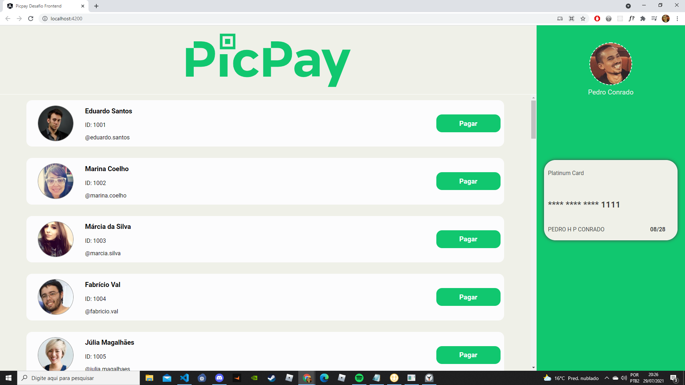
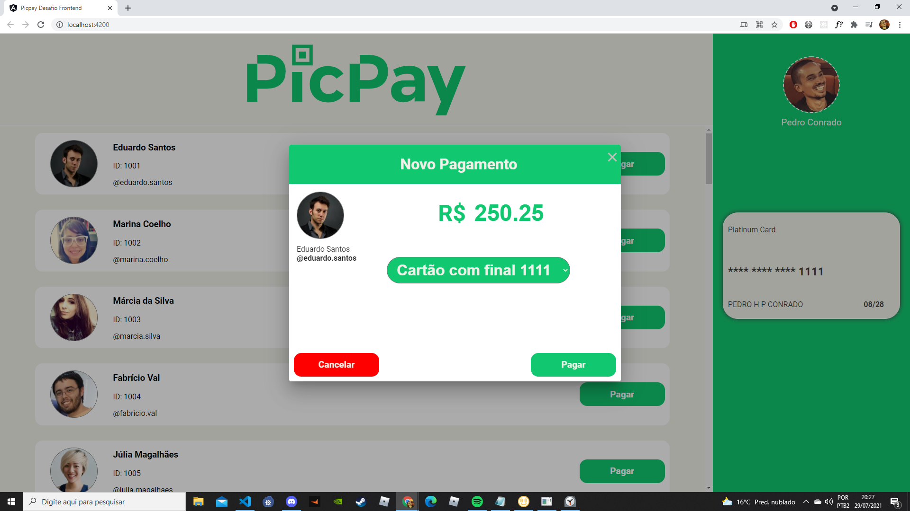
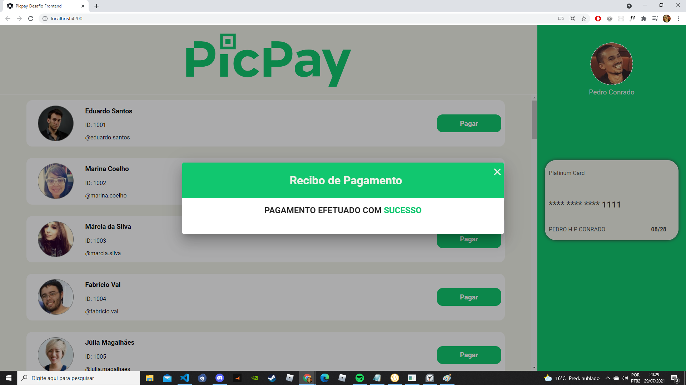
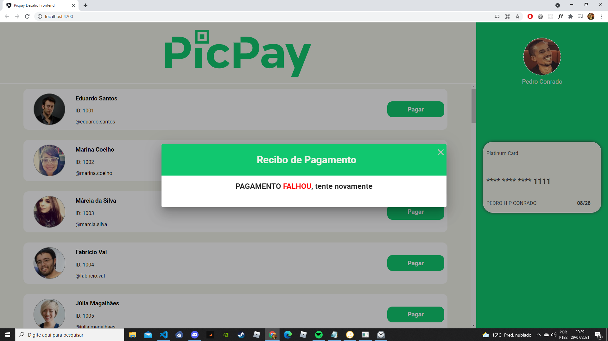

<h1 align="center">
    
</h1>

<br>

## 🧪 Tecnologias

Esse projeto foi desenvolvido com as seguintes tecnologias:

- [Angular](https://angular.io/)
- [TypeScript](https://www.typescriptlang.org/)

## 🚀 Como executar

Clone o projeto e acesse a pasta do mesmo.

```bash
$ https://github.com/PedroHConrado/picpay-desafio-frontend.git
$ cd picpay-desafio-frontend
```

Para iniciá-lo, siga os passos abaixo:
```bash
# Instalar as dependências
$ yarn

# Iniciar o projeto
$ yarn server
$ ng serve
```
O app estará disponível no seu browser pelo endereço http://localhost:4200.

## 💻 Projeto

Uma aplicação que simula o envio de pagamento para uma contato que você tenha adicionado, via cartão de crédito. 

Este é um projeto desenvolvido para o Desafio Front-end PicPay.


## 🔖 Layout






---

Feito com 💜 by Pedro Conrado
